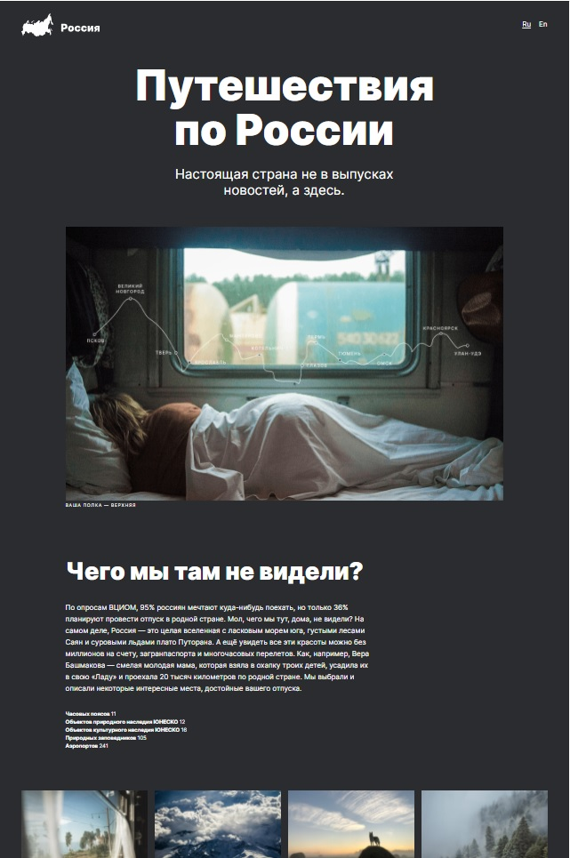
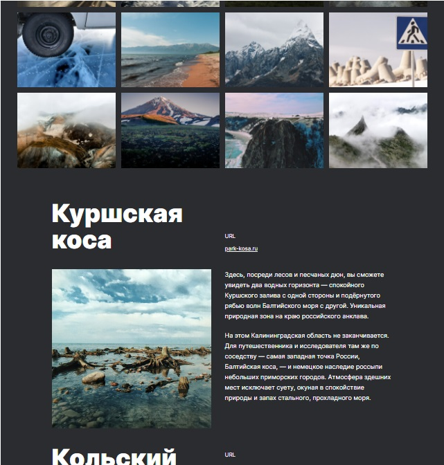

# Проект: Путешествие по России

## Сайт о красивых местах России.
 

Сайт является адаптивным и корректно отобржается на большинстве современных разрешений.
В нем использованы современные методы верстки с помощь "Grid" и "Flexbox"
 
Сайт доступен по ссылке https://olgerd999.github.io/russian-travel/

 

 

Картинки оптимизированы с помощью тега ``<picture>`` что улучшаем скорость работы на медленных устройствах с медленным интернетом.

Автор проекта Хвостов Олег Игоревич.

